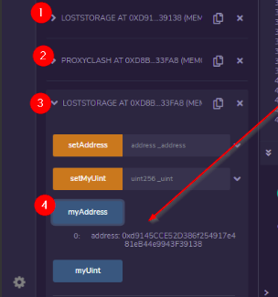

# Upgrading-SmartContracts
Methods to upgrade smart contracts

1. Parameterize

Really usn't upgrading
-can't add storage
-can't add new logic

use setter functions

simple but not flexible

who the admins?
Add governance protocol 

# Addresses Provider Registery

# Migration contracts

A migration has two steps:

Recovering the data to migrate
Writing the data to the new contract

# Proxy

1. can update the state of the contract
2. keep an contract address 
3. Allow us to update any type of logic in our smart contract

# Proxy Terminolgy:

1. The implementation contract
-It has all our code of our protocol.When we upgrade, we launch a brand new implementation contract

2. The proxy contract
-which points which implementationis the correct one, and route everyone's function call to that contract.

3. The user 
-They make calls to proxy

4. The admin 
-This is the user(or grp of users/voters) who upgrade to new implementation contracts.

All the storage variable will be stored in theproxy contract and not in the implementation contract
 

# Eternal storage

Lose address but will keep storage 
Seprating logic from storage

1. A storage smart contract that purely storing the valuesand doesn't have a lot of logic.
Then we have  logic smart contract

# The First Proxy Contract

The first proxy that was ever proposed  came from Nick Johnson(not sure). He's founder and lead dev at the ENS (Ethereum Name Service).


1. Dispatcher -proxy smart contract
2. Example- Target address

```shell
    fallback() external {
        bytes4 sig;
        assembly { sig := calldataload(0) }
        uint len = _sizes[sig];
        address target = _dest;

        assembly {
            // return _dest.delegatecall(msg.data)
            calldatacopy(0x0, 0x0, calldatasize())
            let result := delegatecall(sub(gas(), 10000), target, 0x0, calldatasize(), 0, len)
            return(0, len) //we throw away any return data
        }
```

Note: (For delegate call understanding)Instead of running the code of the target contract(Examplr) on the target contracts address, we're running the code of the target contract on the contract that called the target(Which is Dispatcher).

Steps: 
1. Deploy Example- Target address or logic contract
2. Deploy the Dispatcher (constructor args should be dispatcher contract)
3. use the Example on the Dispatchers address(How to do this?)
* Below deploy button there is AtAddress, provide dispatcher address and deploy exmaple contract with dispatcher address

# How to use it in upgradablity?

1. upgrade smart contract(For instance:return _value*2)
2. Again Deploy the Example contract
3. Replace new example address in dispatcherusing the replace function
4. Now our smart contract is upgraded on the same address(it means it return value multiplied by 2)


# Storage collision

# Steps:

1. Deploy the LostStorage Contract
2. Deploy the Proxy, setting the LostStorage contract address as the constructor argument
3. Tell Remix that the LostStorage is running on the Proxy address
4. Call myAddress(). It surprisingly returns a non-zero address even though we haven't set any address.




# Q. Why does this happen?
In lost storage contract at slot zero myAddress is stored and at slot 1 some uit value is stored.
In proxy contract at slot 0 otherContractAddress is stored whose value is set at time of deployment. As we know LostStorage is running on the Proxy address so now the slot zero value will be the proxy contract otherContractAddress.


# EIP-897: ERC Delegate Proxy 

created in 2018
We have proxy storage that stores the logic and then we have an actual storage smart contract that also inherits feom proxy storage
